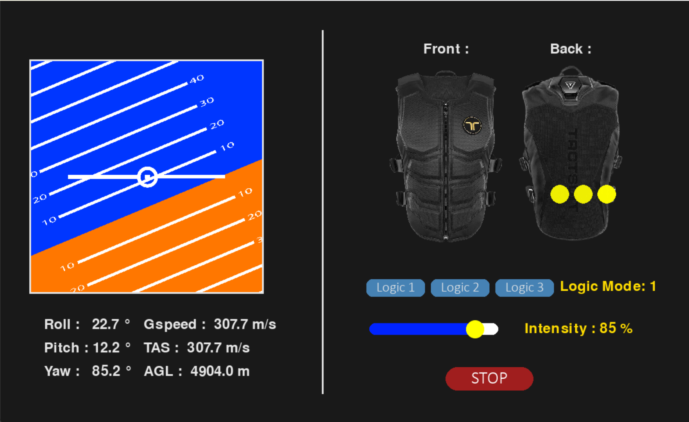
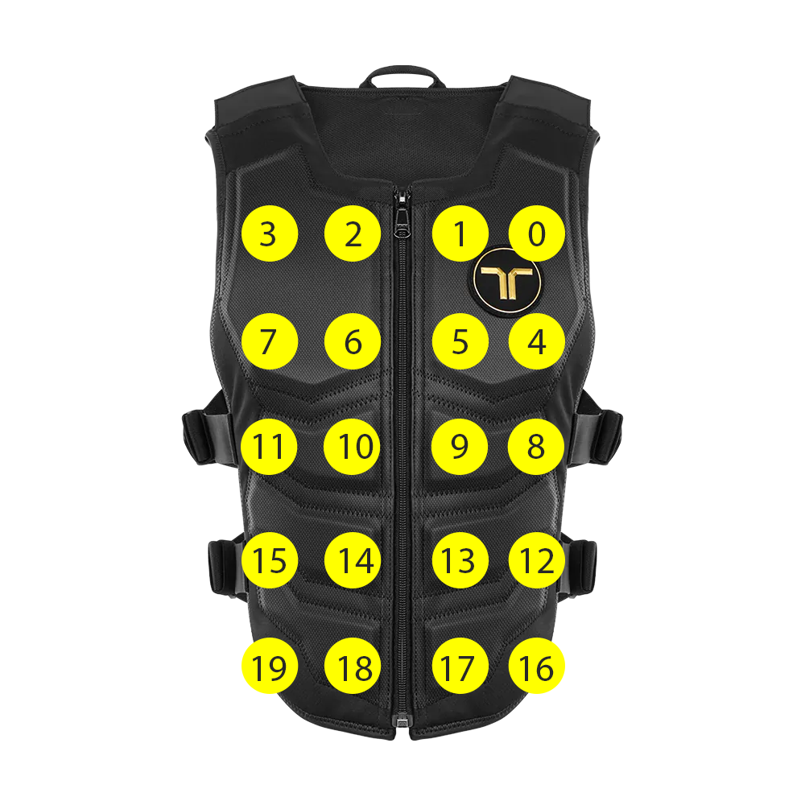
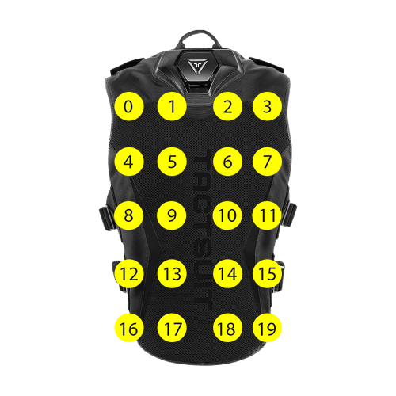
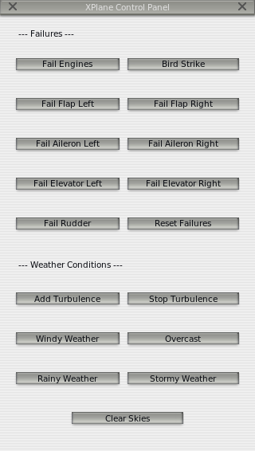

# XPlane-Haptic-Interface

This repository gathers two projects developed during my engineering internship. Both interact with the X-Plane flight simulator:

- 🧠 A **Python program** that retrieves real-time flight data from X-Plane and triggers haptic feedback using the **bHaptics TactSuit X40**.
- ✈️ A **C++ plugin** for X-Plane that displays an interactive window with buttons to trigger failures, adjust weather, or test control surfaces.

 Helps pilots fight spatial disorientation in simulator training faut mettre l'accent sur ça là

---
# 🔧 Contents

## 1. `python_interface/`

A Python application using:

- `XPlaneConnect` to communicate with X-Plane
- `PyGame` and `PyGame_widgets` to build a GUI
- `multithreading` to handle real-time data and feedback
- `bHaptics` SDK to send vibration patterns

**Features:**
- Displays real-time flight data
- Sends vibrations cues based on the plane attitude
- Different vibrating logics available

### 📸 GUI Example

<p align="center">
   
</p>
*Real-time data from X-Plane with attitude visualisation.*

### 📸 Vest Feedback Zones

<p align="center">
   
   
</p>
*bHaptics TactSuit x40 tactors index. Front on the left, back on the right*

---

## 2. `Control_panel_XP/`

A plugin for X-Plane (written in C++) using the XPLM SDK:

- Opens a custom window inside X-Plane
- Provides buttons to:
  - Reset all failures
  - Inject various weather conditions
  - Disable control surfaces (rudder, elevator, ailerons, etc.)

### 📸 Plugin Window
<p align="center">
   
</p>
*Custom window inside X-Plane with interactive controls.*


---
# 🏁 How to use

## Software
- Windows 10/11
- Python 3.13.5 (tested)
- Visual studio code (recommended)
- Microsoft visual studio (recommended)
- [bHaptics player](https://www.bhaptics.com/software/player/) 2.6.3.86 (86)
- XPlane 11/12 (tested)

## Requirements

All the librairies needed are listed in [requirements.txt](/python_interface/requirements.txt).
```bash
keyboard==0.13.5
pybind11==3.0.0
pygame==2.6.1
pygame_widgets==1.2.2
setuptools==80.8.0
websocket_client==0.57.0

tactcombine==0.1
```
### Standard librairies
You can install all the standard python libraries with :

```bash
pip install keyboard==0.13.5 pybind11==3.0.0 pygame==2.6.1 pygame_widgets==1.2.2 setuptools==80.8.0 websocket_client==0.57.0
```
### Custom librairy
Since `tactcombine` is a custom library, you will need to build it manually from the `python_interface/combine/` directory using pybind11 :

```bash
pip install ./python_interface/combine
```
The library will be added to your python PATH.

(A [precompiled version of the tactcombine library](/python_interface/combine/tactcombine.cp313-win_amd64.pyd) is also included for Windows. This allows immediate use without requiring compilation.)

### Local SDK/plugin
You will also need the following dependencies :
- [XPlane connect Plugin](https://github.com/nasa/XPlaneConnect) included [here](/python_interface/libs/xpc)
- [bHaptics python SDK](https://github.com/bhaptics/tact-python/) included [here](/python_interface/libs/bhaptics/)

## Python Program
### Run the application
1. The bHaptics player needs to be launched first
2. Connect the TactSuit and launch XPlane
3. Run the [main program](/python_interface/main.py)

   ```bash
   python main.py
   ```
### Operating logics
The differents vibrating logics are implemented and can be modified through the `logic1.py`, `logic2.py`, `logic3.py`, `logic4.py` files.


## X-Plane Plugin
You can either use the [pre-compiled plugin](/Control_panel_XP/plugin_output/plugin/control_panel/) and put it into (for example) :
  ```
   C:\X-Plane 12\Resources\plugins
  ```

  Or you can edit the [source code](/Control_panel_XP/control_panel.cpp) and compile it yourself :
1. Build the plugin using a C++ compiler with the [XPlane SDK](https://developer.x-plane.com/sdk/) included [here](/Control_panel_XP/SDK/)
2. Copy the compiled folder with the `.xpl` and `.pdb`files into :

   ```
   X-Plane/Resources/plugins/XPlaneInterface/
   ```
3. Launch X-Plane and use the plugin

---
# 📁 Repository Structure

```
XPlane-Haptic-Interface/
│
├── python_interface/     ← Python haptic integration + GUI
├── xp_plugin/            ← C++ plugin for XPlane
├── images/               ← Illustrations for README
├── .gitignore
└── README.md
```

---
# 👨‍🔬 Author


**Pierre Bourrandy**, 4th year Mechatronics Engineering student - **ENSIL-ENSCI**
This project was part of my internship at **IISRI**.

Many thanks to **Mr. Houshyar Asadi** for the inspiring topic, support, and trust throughout the internship.

## Contact detail
pierre.bourrandy@etu.unilim.fr *(ENSIL-ENSCI)*

