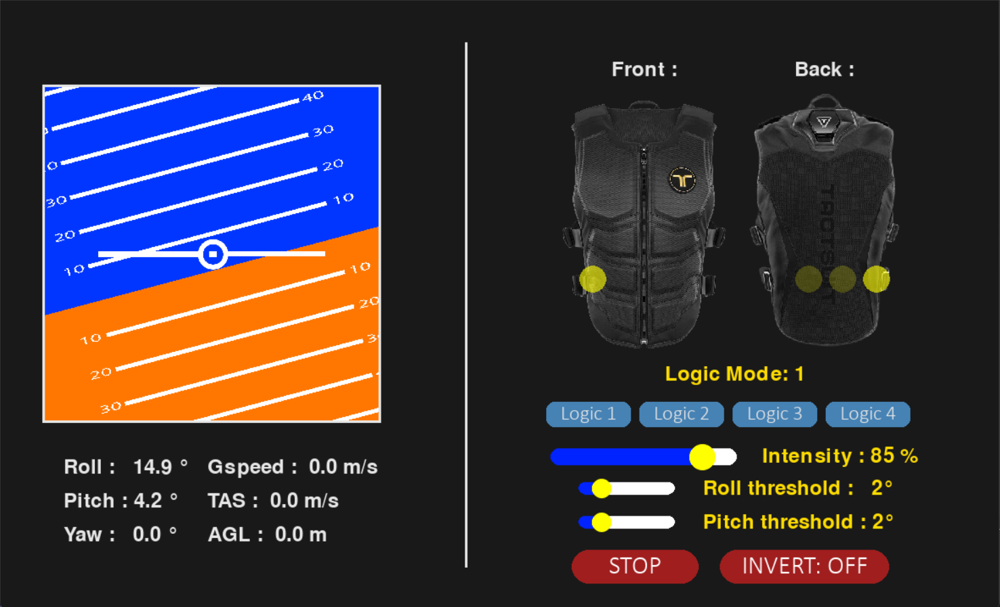

TOut pourri encore

# XPlane-Haptic-Interface

This repository gathers two independent projects developed during my engineering internship. Both interact with the X-Plane flight simulator:

- 🧠 A **Python program** that retrieves real-time flight data from X-Plane and triggers haptic feedback using the **bHaptics TactSuit X40**.
- ✈️ A **C++ plugin** for X-Plane that displays an interactive window with buttons to trigger failures, adjust weather, or test control surfaces.

---

## 🔧 Contents

### 1. `python_interface/`

A Python application using:

- `xplaneconnect` to communicate with X-Plane
- `pygame` and `pygame_widgets` to build a GUI
- `multiprocessing` to handle real-time data and feedback
- `bHaptics` SDK to send vibration patterns

**Features:**
- Displays real-time flight data
- Sends vibrations based on pitch, roll, altitude, or yaw rate
- Helps pilots fight spatial disorientation in simulator training

#### 📸 GUI Example

<p align="center">
   
</p>
*Real-time data from X-Plane with attitude visualisation.*

#### 📸 Vest Feedback Zones

<p align="center">
   
   
</p>
*bHaptics TactSuit x40 tactors index. Front on the left, back on the right*

---

### 2. `xp_plugin/`

A native plugin for X-Plane (written in C++) using the XPLM SDK:

- Opens a custom window inside X-Plane
- Provides buttons to:
  - Reset all failures
  - Inject various weather conditions
  - Disable control surfaces (rudder, elevator, ailerons, etc.)
- Fully compatible with X-Plane 11 and 12

#### 📸 Plugin Window
<p align="center">
   
</p>
*Custom window inside X-Plane with interactive controls.*

---

## 🏁 How to Run

### Python Program
1. Install requirements:
   ```bash
   pip install pygame pygame_widgets xplaneconnect
   ```
2. Connect your TactSuit and X-Plane simulator
3. Launch the GUI:
   ```bash
   python main.py
   ```

### X-Plane Plugin
1. Build the plugin using a C++ compiler with the XPLM SDK
2. Copy the compiled `.xpl` plugin into:
   ```
   X-Plane/Resources/plugins/XPlaneInterface/
   ```
3. Launch X-Plane and activate the plugin from the **Plugins** menu

---

## 📁 Folder Structure

```
XPlane-Haptic-Interface/
│
├── python_interface/     ← Python GUI + haptic integration
├── xp_plugin/            ← C++ plugin using XPLM SDK
├── images/               ← Screenshots and diagrams for README
├── .gitignore
└── README.md             ← This file
```

---

## Requirements

A precompiled version of the tactcombine library is included for Windows / Python 3.11:

combine/prebuilt/tactcombine.cp311-win_amd64.pyd

This allows immediate use without requiring compilation.

from combine import tactcombine (en ligne de code)

For other operating systems or Python versions, you'll need to build the library manually from the sources located in the combine/ folder.
🔧 Manual Build

To build the library yourself, you will need:

    CMake

    pybind11

    A C++11-compatible compiler

pip install ./python_interface/combine (en lgine de code)

The compiled file will be added to your python path

## 👨‍🔬 Author

**Pierre Bourrandy**
Engineering student in Mechatronics – ENSIL-ENSCI
2025 Internship Project – Australia 🇦🇺

---

## 📜 License

This project is intended for academic and personal demonstration purposes.
For commercial or extended use, please contact the author.
